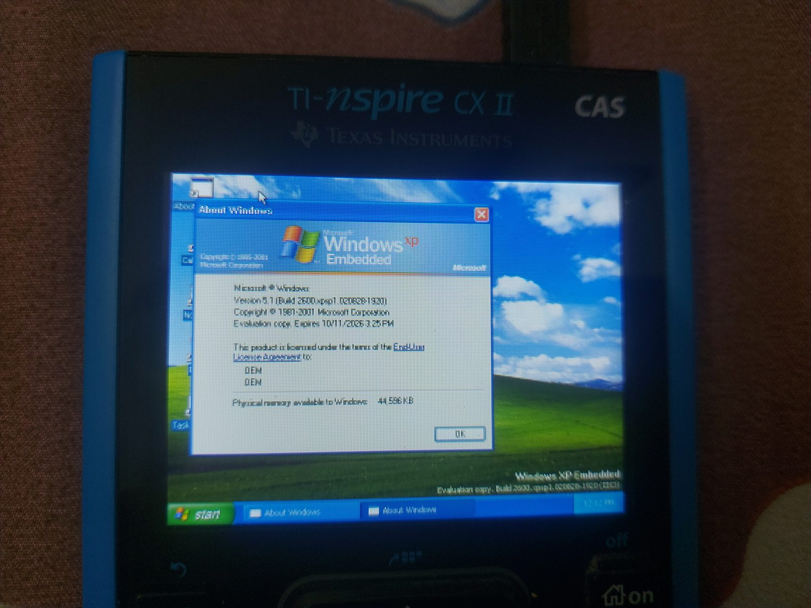

# WiNspire
>Windows... on your calculator.

  

=
WiNspire is an x86 PC emulator for the TI-Nspire CX II / CX II CAS based on tiny386. It can boot every major Windows release from 1.0 to XP!*

WiNspire has two modes - **Native** and **Server**

1. **Native**: runs directly under Ndless and the disk image is stored on the calculator.
2. **Server**: runs through LinuxLoader2 and the disk is accessed from a host device over USB.

# Getting Started
To get started, check out the [WiNspire Wiki](https://winspire.idrees.in) ! 

# Contributing
Contributions are welcome! Please feel free to open a PR or issue.

# License
WiNspire is licensed under the [BSD-3-Clause license](https://spdx.org/licenses/BSD-3-Clause.html). Third party components, wherever used, retain their own licenses.

**Boot time varies from seconds to over an hour depending on the Windows version :)*
